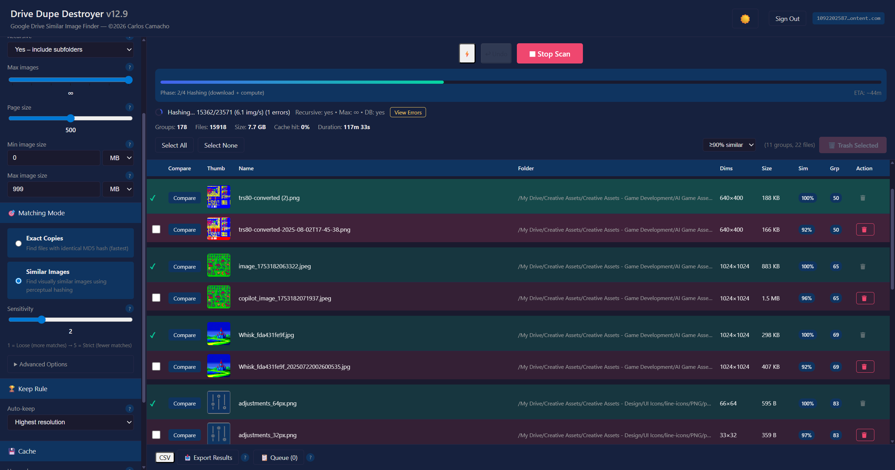
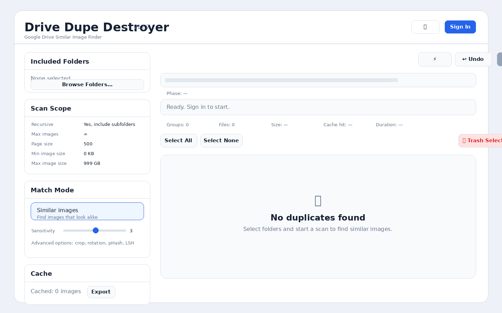
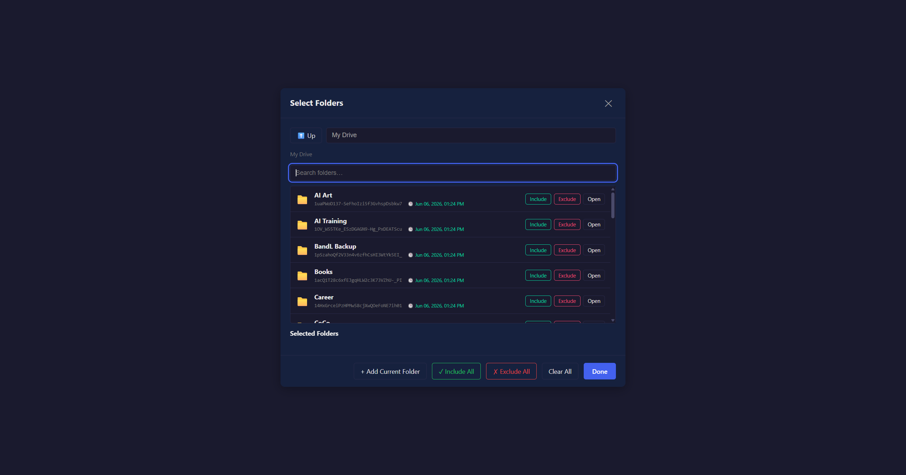
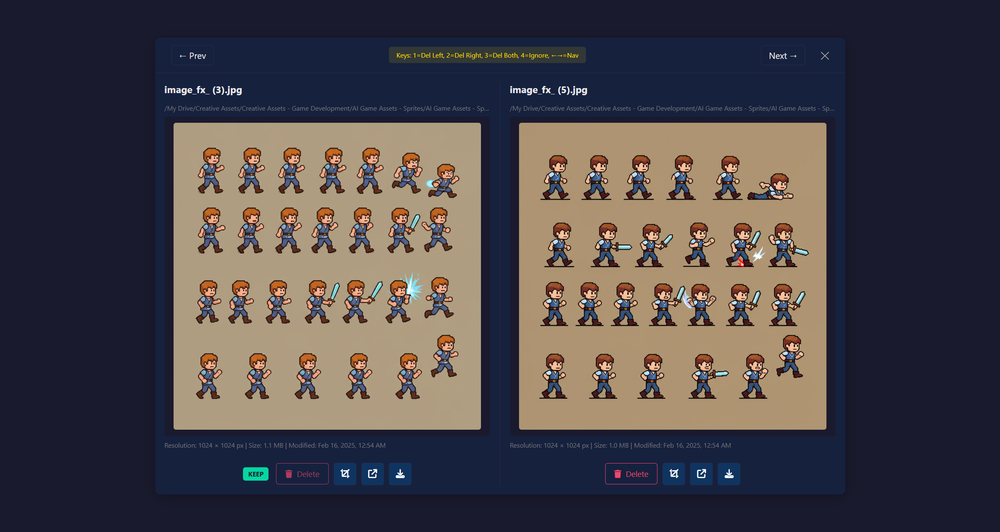

<div align="center">

# Drive Dupe Destroyer

### A browser-based Google Drive duplicate image finder with safe review, side-by-side comparison, export, and undo support.

<p>
  
  
  
  
  
  <a href="https://www.paypal.com/cgi-bin/webscr?cmd=_donations&business=idevgames%40gmail.com&item_name=Support%20Drive%20Dupe%20Destroyer&currency_code=USD">
    
  </a>
</p>

<p>
  <a href="#quick-start">Quick Start</a> •
  <a href="#screenshots">Screenshots</a> •
  <a href="#google-oauth-setup">OAuth Setup</a> •
  <a href="#support-this-project">Donate</a> •
  <a href="docs/instructions.html">Visual Guide</a>
</p>

<p>
  <a href="https://www.paypal.com/cgi-bin/webscr?cmd=_donations&business=idevgames%40gmail.com&item_name=Support%20Drive%20Dupe%20Destroyer&currency_code=USD">
    
  </a>
</p>

</div>

---

## Overview

**Drive Dupe Destroyer**, or **DDD**, helps you find duplicate and visually similar images in Google Drive. It lets you scan selected folders, compare suspected duplicates side by side, export results, and safely move unwanted files to **Google Drive Trash**.

The app is a **static browser app**. There is no backend server required. Image metadata, thumbnails, hashes, settings, rejected pairs, and scan state are stored locally in the browser unless you choose to export results.

> **Safety first:** Drive Dupe Destroyer moves files to Google Drive Trash. It does not permanently delete files.

<p align="center">
  
</p>

---

## Why Use It?

Google Drive makes it easy to accumulate duplicate images across folders, backups, exports, and renamed files. Drive Dupe Destroyer is designed to help you clean those files up with review controls before anything is moved to Trash.

| Problem | How DDD helps |
|---|---|
| Duplicate images are scattered across Drive folders | Scan selected folders recursively. |
| Files may be renamed but visually identical | Match exact copies and visually similar images. |
| It is risky to delete without reviewing | Compare suspected duplicates side by side. |
| Large scans can take time | Cache results locally and support resume/delta scan behavior. |
| You need records before cleanup | Export CSV or JSON results. |

---

## Features

- **Exact duplicate detection** using Google Drive MD5 checksums.
- **Similar image detection** using browser-based perceptual hashing.
- **Advanced matching options** including dHash, pHash, color/edge matching, crop detection, rotation variants, flip variants, aspect-ratio filtering, and LSH candidate matching.
- **Wide format support:** JPEG, PNG, GIF, WebP, BMP, TIFF, SVG, HEIC/HEIF, AVIF, ICO, JPEG 2000, JPEG XL, Netpbm (PPM/PGM/PBM), RAW camera files, and the design/legacy formats **PSD, TGA, IFF/ILBM, and PCX**.
- **Per-format scan selection** — an Image Types panel lets you include or exclude specific formats from a scan.
- **Folder-based scanning** with optional recursive traversal.
- **Side-by-side compare modal** for reviewing duplicate candidates before trashing files.
- **Download or delete any image** directly from the results table — including the keep file (with confirmation).
- **Clickable File Location** — open the file's containing Google Drive folder in a new tab from the table or the compare modal.
- **Graceful image placeholders** instead of broken-image icons while thumbnails load or if an image fails to load.
- **Undo delete support** for recently trashed files.
- **False-positive rejection memory** so ignored pairs are not repeatedly shown.
- **Delta scan support** for scanning changed Drive files after a previous scan.
- **Resume support** after refresh or browser interruption.
- **CSV and JSON export** with match metadata.
- **IndexedDB cache** for faster repeat scans.
- **Dark/light theme toggle**.
- **Security-hardened local server** with COOP, COEP, CSP, and related browser security headers.

---

## Screenshots

### Start Screen

<p align="center">
  
</p>

### Select Google Drive Folders

<p align="center">
  
</p>

### Review Duplicate Results

<p align="center">
  
</p>

### Compare Images Before Trashing

<p align="center">
  
</p>

---

## Quick Start

### 1. Clone or download the project

```bash
git clone https://github.com/YOUR-USERNAME/drive-dupe-destroyer.git
cd drive-dupe-destroyer
```

Or download the ZIP and open the project folder in a terminal.

### 2. Start the secure local server

```bash
python3 serve_secure.py
```

On Windows, use:

```bash
python serve_secure.py
```

### 3. Open the app

```text
http://localhost:8080
```

### 4. Sign in with Google

Paste your Google OAuth Client ID when prompted. The Client ID normally ends with:

```text
.apps.googleusercontent.com
```

### 5. Select folders and scan

Choose one or more Google Drive folders, set your scan options (optionally narrow the formats in the **Image Types** panel), then click **Start Scan**.

---

## Google OAuth Setup

Drive Dupe Destroyer uses Google OAuth to access Google Drive with your permission.

### 1. Create a Google Cloud project

Open Google Cloud Console and create a new project.

### 2. Enable the Google Drive API

Go to:

```text
APIs & Services → Library → Google Drive API → Enable
```

### 3. Configure the OAuth consent screen

Go to:

```text
APIs & Services → OAuth consent screen
```

For local testing, add yourself as a test user.

### 4. Create an OAuth Client ID

Go to:

```text
APIs & Services → Credentials → Create Credentials → OAuth client ID
```

Choose:

```text
Application type: Web application
```

Add this authorized JavaScript origin for local development:

```text
http://localhost:8080
```

If you deploy with GitHub Pages, also add your production origin, for example:

```text
https://YOUR-USERNAME.github.io
```

Copy the generated Client ID and paste it into the app when prompted.

---

## Google Drive Scope

The app requests this Google OAuth scope:

```text
https://www.googleapis.com/auth/drive
```

This scope is used to:

- Browse user-selected Google Drive folders.
- Read image metadata and thumbnails.
- Use Drive checksums for exact duplicate detection.
- Move selected duplicate files to Google Drive Trash.
- Restore recently trashed files when Undo is used.

The app does **not** access Gmail, Calendar, Contacts, or other Google services.

---

## How It Works

DDD scans selected Google Drive folders and identifies duplicates in two ways.

### Exact Copies

Files with the same Drive-provided MD5 checksum are grouped as exact duplicates.

### Similar Images

Image thumbnails are processed in the browser to create visual fingerprints. DDD compares those fingerprints to detect images that look alike, even if they differ by compression, size, crop, brightness, rotation, or file format.

---

## Recommended First Scan Settings

| Setting | Recommended value | Why |
|---|---:|---|
| Recursive | Yes | Includes images inside subfolders. |
| Image Types | All | Start broad; narrow later if you only care about certain formats. |
| Match Mode | Similar images | Finds renamed, resized, compressed, or slightly edited copies. |
| Sensitivity | 3 | Balanced starting point. |
| Cache | On | Speeds up repeat scans. |
| Crop Detection | Optional | Useful when images may be cropped versions of each other. |
| Rotation Variants | Optional | Useful when some images may be rotated. |

---

## Reviewing Results

When scan results appear, review duplicate groups before trashing anything.

| Column | Meaning |
|---|---|
| Compare | Opens side-by-side image comparison. |
| Thumb | Shows a preview thumbnail (a placeholder appears until it loads). |
| Name | Shows file name and keep/delete recommendation. |
| Folder | **File Location** — click to open the containing Google Drive folder in a new tab. |
| Dims | Shows image dimensions. |
| Size | Shows file size. |
| Sim | Shows similarity score. |
| Group / Match | Shows the duplicate group number and a similarity band badge (identical / near / similar / loose). |
| Action | **Download** or **Trash** this specific file. The keep file can also be downloaded or deleted (deletion asks for confirmation). |

Keyboard shortcuts in the comparison view:

| Key | Action |
|---:|---|
| 1 | Delete left image. |
| 2 | Delete right image. |
| 3 | Delete both images. |
| 4 | Ignore this pair (mark as not a duplicate; suppressed in future scans). |
| ← / → | Move to previous or next comparison. |

After you delete or ignore a pair, it is removed from the results list so you never review it twice.

---

## Deploying to GitHub Pages

Because DDD is a static web app, it can be hosted on GitHub Pages.

1. Push the project to GitHub.
2. Go to **Settings → Pages**.
3. Select your branch, usually `main`.
4. Select the folder to publish (the repository root).
5. Save the Pages configuration.
6. Add your GitHub Pages origin to your Google OAuth Client ID.
7. Confirm `privacy.html` and `terms.html` are publicly accessible.

Example public URLs:

```text
https://YOUR-USERNAME.github.io/drive-dupe-destroyer/
https://YOUR-USERNAME.github.io/drive-dupe-destroyer/privacy.html
https://YOUR-USERNAME.github.io/drive-dupe-destroyer/terms.html
```

> **Note on `serve_secure.py`:** GitHub Pages cannot send the COOP/COEP headers that enable the SharedArrayBuffer zero-copy path, so that optimization is local-server only. The app works correctly on Pages without it — just slightly slower on very large scans.

For a more polished documentation page, link to:

```text
docs/instructions.html
```

---

## Security and Privacy

Drive Dupe Destroyer is designed to keep data local wherever possible.

- Access tokens are held in browser memory.
- Tokens are not written to `localStorage`.
- App settings, hashes, rejected pairs, and resume state are stored in IndexedDB.
- Image processing runs locally in the browser.
- The app communicates with Google OAuth and Google Drive APIs.
- Files selected for deletion are moved to Google Drive Trash, not permanently deleted.
- The included `serve_secure.py` sends browser security headers required for stronger browser isolation.

For more detail, see:

- [`privacy.html`](privacy.html)
- [`terms.html`](terms.html)
- [`docs/OAUTH_VERIFICATION_GUIDE.md`](docs/OAUTH_VERIFICATION_GUIDE.md)

---

## Project Structure

```text
drive-dupe-destroyer/
├── index.html                  # Main application UI
├── styles.css                  # App styling
├── sw.js                       # Service worker and security-header fallback
├── serve_secure.py             # Local development server with security headers
├── privacy.html                # Privacy policy page (OAuth verification + Pages)
├── terms.html                  # Terms of service page (OAuth verification + Pages)
├── README.md                   # This file
├── CHANGELOG.md                # Consolidated changelog (newest first)
├── LICENSE                     # PolyForm Noncommercial 1.0.0
├── .gitignore
├── js/                         # Application modules (32 files)
│   ├── app.js                  # Main application wiring
│   ├── auth.js                 # Google OAuth flow
│   ├── drive.js                # Google Drive API calls
│   ├── scan.js                 # Scan orchestration
│   ├── hashing.js              # Hashing pipeline
│   ├── worker-hash.js          # Web worker image hashing
│   ├── compare.js              # Side-by-side compare modal
│   ├── render.js               # Results rendering
│   ├── exporter.js             # CSV/JSON export
│   ├── db.js                   # IndexedDB storage
│   ├── settings.js             # Persistent scan settings
│   ├── telemetry.js            # Performance overlay
│   ├── undo.js                 # Restore recently trashed files
│   └── …                       # auth/security/lsh/phash/queue/… and more
├── docs/
│   ├── DDD-v14-Manual.docx     # Full user manual (v14)
│   ├── OAUTH_VERIFICATION_GUIDE.md
│   ├── instructions.html       # Polished visual instructions page
│   ├── INSTRUCTIONS.md         # Markdown user guide
│   ├── screenshots/            # README and guide screenshots
│   ├── changelog/              # Original per-version changelog notes (archive)
│   └── dev-notes/              # Internal patch / refactor notes
└── tools/
    └── patch_decimator.py      # Developer utility script
```

---

## Troubleshooting

| Issue | What to check |
|---|---|
| Sign-in fails | Confirm the OAuth Client ID and authorized JavaScript origin. |
| Folder picker is empty | Confirm Google Drive API is enabled and the user granted Drive access. |
| Scan finds 0 images | Confirm the folder has images; check the Min/Max size filters; check the **Image Types** panel (use *Select all* if you unchecked formats). |
| Scan is slow | Scan fewer folders, keep cache enabled, or lower scan limits. |
| Too many false matches | Increase sensitivity or disable loose matching options. |
| Too few matches | Lower sensitivity or enable crop, rotation, or pHash options. |
| Deleted the wrong file | Use **Undo** immediately or restore the file from Google Drive Trash. |

---

## Full Visual Guide

A full visual walkthrough is available here:

- [`docs/INSTRUCTIONS.md`](docs/INSTRUCTIONS.md)
- [`docs/instructions.html`](docs/instructions.html)
- [`docs/DDD-v14-Manual.docx`](docs/DDD-v14-Manual.docx) — full user manual

---

## Support This Project

Drive Dupe Destroyer is shared as a useful tool for people who need a safer way to clean duplicate images from Google Drive. If it saves you time, helps you clean up storage, or you simply want to support continued development, donations are appreciated.

<p align="center">
  <a href="https://www.paypal.com/cgi-bin/webscr?cmd=_donations&business=idevgames%40gmail.com&item_name=Support%20Drive%20Dupe%20Destroyer&currency_code=USD">
    
  </a>
</p>

<p align="center">
  <a href="https://www.paypal.com/cgi-bin/webscr?cmd=_donations&business=idevgames%40gmail.com&item_name=Support%20Drive%20Dupe%20Destroyer&currency_code=USD">Donate securely with PayPal</a>
</p>

---

## License

Licensed under the **PolyForm Noncommercial License 1.0.0** — see [`LICENSE`](LICENSE) for the full text.

You are free to **use, copy, modify, and share** this software for any
**noncommercial** purpose (personal use, hobby projects, research, education,
nonprofits, and similar). **Commercial use is not permitted** — including
selling the software, selling access to it, or hosting it as a paid product or
service.

> This is a *source-available*, noncommercial license, not an OSI-approved
> open-source license. If you have a commercial use in mind, contact the author
> to discuss separate terms.

Copyright © 2026 Carlos Camacho.
