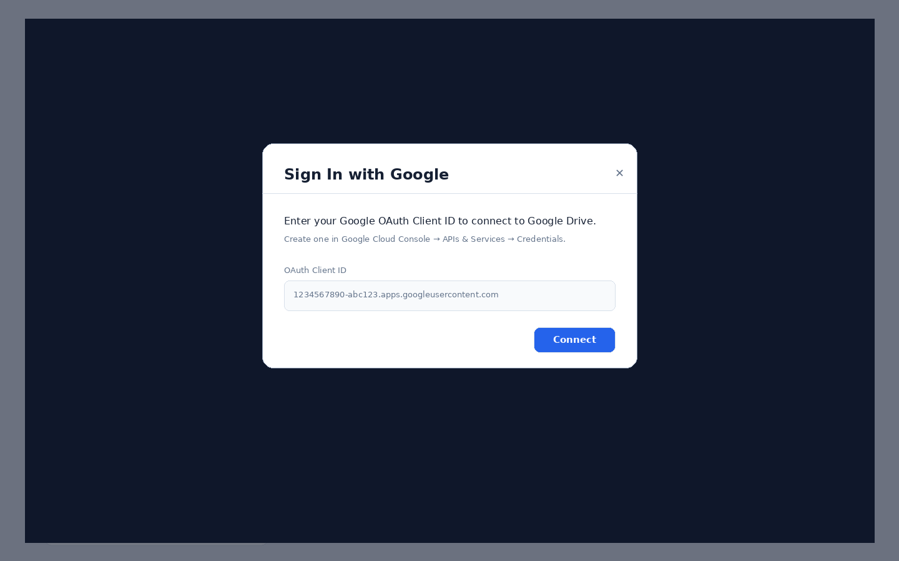

# Drive Dupe Destroyer — User Instructions

A step-by-step guide for signing in, selecting Google Drive folders, scanning for duplicates, reviewing matches, and safely moving unwanted files to Google Drive Trash.

> **Important:** Drive Dupe Destroyer moves files to **Google Drive Trash** only. It does not permanently delete files.

---

## 1. Open the app

Launch the app from your hosted URL or run it locally with the secure server:

```bash
python serve_secure.py
```

Then open:

```text
http://localhost:8080
```


---

## 2. Sign in with Google

Click **Sign In** and enter your Google OAuth Client ID. The Client ID normally ends with:

```text
.apps.googleusercontent.com
```



After connecting, the app can browse selected Google Drive folders, read image metadata and thumbnails, compare possible duplicates, and move selected files to Trash.

---

## 3. Select folders to scan

Click **Browse Folders…**, choose one or more folders, then click **Done**.

Use **Recursive** mode when you want the app to include images inside subfolders.


Recommended starting settings:

| Setting | Recommended value | Why it matters |
|---|---:|---|
| Recursive | Yes | Finds images inside nested folders. |
| Match Mode | Similar images | Finds resized, compressed, renamed, or slightly edited copies. |
| Sensitivity | 3 | Balanced starting point. Increase for stricter matches. |
| Cache | On | Speeds up repeat scans. |

---

## 4. Start the scan

Click **Start Scan**. The progress area shows the current phase, status, duplicate groups, file count, cache hit rate, and scan duration.

For large folders, let the scan finish before reviewing results. You can stop a scan if needed, and the app may resume from saved local state depending on the scan state.

---

## 5. Review duplicate results

When the scan finishes, suspected duplicate files appear in the results table.


Use the table to review:

| Column | Meaning |
|---|---|
| Compare | Opens the side-by-side comparison view. |
| Thumb | Preview thumbnail. |
| Name | File name and keep/delete recommendation. |
| Folder | Google Drive folder location. |
| Dims | Image dimensions. |
| Size | File size. |
| Sim | Similarity score. |
| Grp | Duplicate group number. |
| Action | Trash a specific file. |

You can also filter results by similarity, select multiple files, export results, or queue files before trashing them.

---

## 6. Compare images side by side

Click **Compare** to review a suspected duplicate pair before deleting anything.


Keyboard shortcuts:

| Key | Action |
|---:|---|
| 1 | Delete left image. |
| 2 | Delete right image. |
| 3 | Delete both images. |
| 4 | Ignore this pair. |
| ← / → | Move to previous or next comparison. |

Use the **KEEP** badge and file metadata to decide which image should remain.

---

## 7. Trash selected files

After review, select the unwanted files and click **Trash Selected**.

The app moves files to Google Drive Trash. You can still recover them from Google Drive Trash unless they are permanently deleted later in Google Drive.

Use **Undo** right away if you trashed something by mistake.

---

## 8. Export results

Use **CSV** for spreadsheet review or **Export Results** for a JSON backup of the scan results.

Exports are useful when you want to document what was found before deleting files.

---

## 9. Tips for best results

- Start with **Sensitivity 3** and review a few matches.
- Use stricter sensitivity for folders with many similar but intentionally different images.
- Enable **Crop detection** when images may be cropped versions of each other.
- Enable **Rotation variants** if some files may be rotated.
- Keep **Use cache** enabled for faster repeat scans.
- Always use **Compare** before trashing files in important folders.

---

## Troubleshooting

| Issue | What to check |
|---|---|
| Sign-in fails | Confirm the OAuth Client ID and authorized JavaScript origin. |
| Folder picker is empty | Confirm Google Drive API is enabled and the user granted Drive access. |
| Scan is slow | Lower max images, use cache, or scan fewer folders at a time. |
| Too many false matches | Increase sensitivity or disable loose matching options. |
| Too few matches | Lower sensitivity or enable crop/rotation/pHash options. |
| Deleted wrong file | Use **Undo** immediately or restore from Google Drive Trash. |

